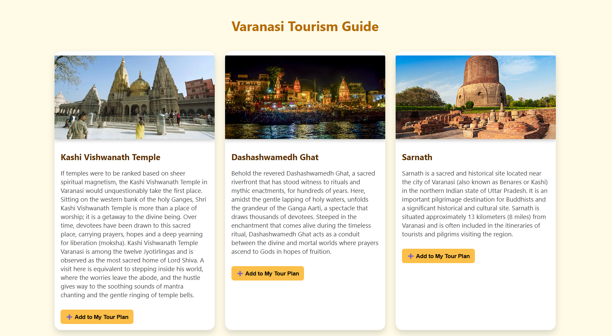
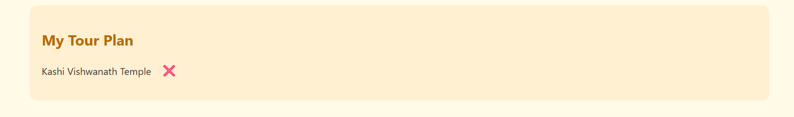

# Varanasi Tourism App

A React app showcasing famous tourist places in Varanasi, India.  
Users can browse places and add them to a personal "Tour Plan".

## Features

- List of popular Varanasi tourist spots with images and descriptions.
- Add/remove places to your personalized Tour Plan.
- Responsive, card-based UI.
- Built with React and CSS.

## Technologies Used

- React.js
- JavaScript
- CSS

  ## Screenshots

